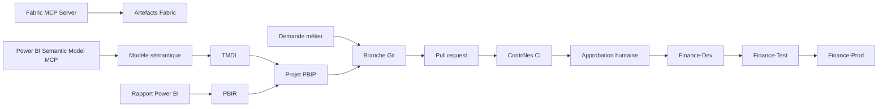

# Démo Microsoft Fabric — CI/CD, Power BI et MCP

> **Dépôt public de démonstration.** Ne jamais y déposer de secrets, jetons, identifiants de tenant, chaînes de connexion, données personnelles ou données client.

## Objectif

Ce dépôt accompagne une démonstration de gestion du cycle de vie d'une solution Finance dans Microsoft Fabric :

- intégration Git du workspace de développement ;
- promotion Development → Test → Production avec un deployment pipeline ;
- gestion d'un projet Power BI avec PBIP, PBIR et TMDL ;
- comparaison pédagogique avec PBIT ;
- utilisation complémentaire de Fabric MCP Server et Power BI Semantic Model MCP Server ;
- validation automatique avant déploiement.

## Architecture

## Environnements

| Étape | Workspace | Usage |
|---|---|---|
| Development | Finance-Dev | Développement, connexion Git et validation initiale |
| Test | Finance-Test | Recette fonctionnelle et tests de non-régression |
| Production | Finance-Prod | Publication contrôlée après approbation |

Seul le workspace Development est connecté au dépôt. Les promotions vers Test et Production passent par le deployment pipeline Fabric.

## Formats Power BI

| Format | Usage |
|---|---|
| PBIT | Modèle Power BI Desktop sans données, utile pour distribuer un template mais peu adapté aux diffs Git |
| PBIP | Enveloppe de projet Power BI versionnable |
| PBIR | Définition textuelle du rapport, de ses pages et de ses visuels |
| TMDL | Définition textuelle du modèle sémantique : tables, mesures, relations et expressions |

Pour le CI/CD, le format de référence est **PBIP + PBIR + TMDL**. PBIT est présenté comme point de comparaison.

## Rôle des deux serveurs MCP

### Fabric MCP Server

Utilisé pour découvrir et administrer les ressources de la plateforme :

- workspaces ;
- Lakehouses et Warehouses ;
- notebooks et pipelines ;
- rapports et modèles sémantiques ;
- capacités et dépendances entre artefacts.

### Power BI Semantic Model MCP Server

Utilisé pour travailler dans le modèle tabulaire :

- tables, colonnes et relations ;
- mesures DAX ;
- requêtes de validation ;
- Best Practice Analyzer ;
- métadonnées TMDL/TMSL.

MCP ne remplace ni Git, ni les tests, ni les approbations : il fournit les outils et le contexte à l'assistant.

## Scénario de démonstration

### Demande métier

Ajouter un indicateur **Budget Variance %** pour comparer le réalisé au budget par mois et centre de coûts.

### Parcours

1. Fabric MCP inventorie les artefacts et leurs dépendances.
2. Semantic Model MCP examine les tables Finance, les relations et les mesures existantes.
3. Une branche de travail est créée.
4. La mesure DAX est ajoutée dans le TMDL.
5. Une visualisation est ajoutée dans le PBIR.
6. Une requête DAX valide le résultat.
7. Une pull request présente les diffs TMDL et PBIR.
8. La CI exécute les contrôles automatiques.
9. Une approbation humaine autorise la promotion.
10. Le deployment pipeline promeut Dev vers Test puis Production.
11. Des contrôles post-déploiement sont exécutés via MCP.

## Contrôles CI recommandés

- structure PBIP valide ;
- parsing TMDL réussi ;
- aucune mesure DAX invalide ;
- Best Practice Analyzer ;
- tests DAX de non-régression ;
- contrôle des dépendances Direct Lake ;
- détection d'une dérive entre le schéma Delta et le modèle ;
- vérification des fichiers modifiés attendus ;
- détection de secrets et d'identifiants d'environnement codés en dur.

## Préparation de la démonstration

- [ ] Connecter Finance-Dev à la branche `main`.
- [ ] Synchroniser les définitions Fabric dans ce dépôt.
- [ ] Créer Finance-Test et Finance-Prod.
- [ ] Créer un deployment pipeline à trois étapes.
- [ ] Définir la stratégie de sources par environnement.
- [ ] Tester les deux serveurs MCP en lecture seule.
- [ ] Préparer une branche avec le changement Budget Variance %.
- [ ] Configurer les validations CI et les règles de pull request.
- [ ] Tester le parcours complet avant la présentation.

## Sécurité

Ce dépôt étant public :

- utiliser exclusivement des données fictives ou anonymisées ;
- ne jamais committer de PAT, clé API, secret, fichier `.env` ou jeton OAuth ;
- ne pas publier de GUID de tenant ni de chaînes de connexion sensibles ;
- contrôler les définitions Fabric avant chaque commit ;
- appliquer le principe du moindre privilège ;
- garder les écritures sur l'environnement Development ;
- exiger une approbation humaine avant Test et Production.

## Message clé

> MCP fournit les outils et le contexte. Git conserve la version de référence et la traçabilité. La CI valide. La CD déploie après approbation.
